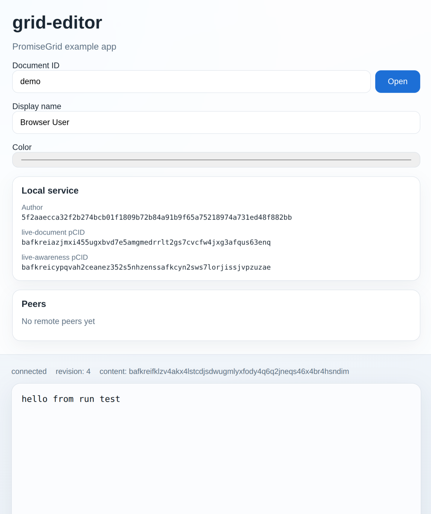

# grid-editor UI example

This document explains what you are looking at when you open the current
browser demo for `grid-editor`.

In plain terms, this screen is a small browser-based view into a local
`grid-editor` service. That service is the real PromiseGrid-facing part of the
example app: it owns the signing identity, the repo-local protocol selection,
the append-only message log, and the current projected document and awareness
state. The browser page is intentionally thin. It lets you choose a document,
type text, and send cursor/presence updates, but it is not the source of truth
for the protocol or the shared state.

So when this page shows values like an `Author`, a `live-document pCID`, or a
`content` CID, it is really showing you facts about the local Go service and
the signed state it is managing, not just browser-only UI values. Source:
`DI-lodug`; `DI-tofug`; `DI-jilin`.

## Header

### `PromiseGrid example app`

- The page is a demo UI for the `grid-editor` example repo.
- It talks to the local Go service, which owns the actual document and
  awareness state.

## Document controls

### `Document ID`

- This is the logical name of the shared document.
- Opening the same document ID on the same service, or on synced peer
  services, points at the same document stream.

### `Open`

- This tells the page to switch to the selected document ID.
- After opening, the page polls the local service for the current document and
  awareness state for that document.

### `Display name`

- This is a human-facing presence label.
- It is not the durable identity used to sign messages.

### `Color`

- This is a human-facing presence color used in the UI.
- It is presentation data, not identity data.

## Local service section

### `Author`

- This is the durable local author ID derived from the service's stored
  `Ed25519` public key. Source: `DI-jilin`.
- The service uses this identity when it signs `live-document` and
  `live-awareness` messages.

### `live-document pCID`

- This is the content-addressed ID of the exact local `live-document` spec
  file.
- It identifies the current draft protocol used for signed document-update
  messages. Source: `DI-tofug`.

### `live-awareness pCID`

- This is the content-addressed ID of the exact local `live-awareness` spec
  file.
- It identifies the current draft protocol used for signed awareness messages.
  Source: `DI-tofug`.

## Peers

### `Peers`

- This section lists the currently visible awareness states for the active
  document.
- `No remote peers yet` means no other authors are currently visible for that
  document, or only the local author has written awareness state so far.

## Status bar

### `connected`

- The browser page can currently reach the local Go service over the internal
  HTTP adapter.

### `revision: 4`

- This is the current projected document Lamport clock value.
- It shows the order position of the accepted document state rather than a Git
  revision or file save count. Source: `DI-jilin`.
- A value greater than `1` usually means the service has already accepted prior
  document or awareness messages in its append-only local history.

### `content: bafk...`

- This is the CID of the exact current document text bytes.
- If the text changes, this CID changes too.
- It is the content-addressed identity of the current projected document
  content.

## Quick distinction

### `Author` vs `Display name`

- `Author` is the durable signing identity.
- `Display name` is just a presentation label shown to people.

### `pCID` vs `content CID`

- A `pCID` identifies the protocol spec being spoken.
- The `content` CID identifies the current document text bytes.

### Why there are two pCIDs

- `live-document` and `live-awareness` are separate protocol families in this
  repo because document state and awareness state have different cadence and
  durability pressure. Source: `DI-tofug`.
