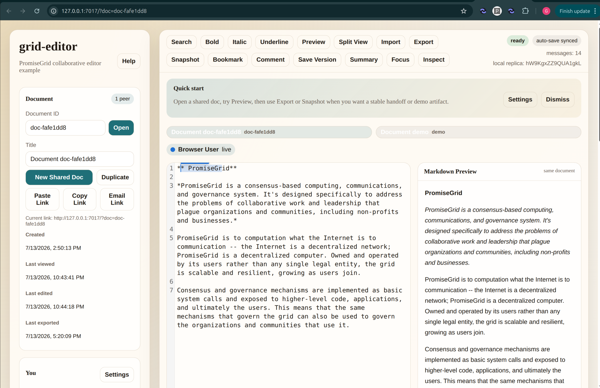

# grid-editor UI example

This page explains the browser UI for `grid-editor`.

The browser is a thin working surface on top of the local Go relay. The relay
owns the signing identity, protocol selection, append-only log, CAS-backed
objects, and shared relay-backed metadata. The browser owns the local editing
experience, local CRDT replica, and some workflow/review conveniences. Source:
`DI-lodug`; `DI-ramuv`; `DI-larok`; `DI-loruk`; `DI-sukip`.

## What this screen is

- Left side: document, identity, workspace, relay, peer, metadata, and review
  controls.
- Top center/right: the main action bar and live status.
- Middle: welcome banner, open document tabs, and visible peer badges.
- Main body: the editor and optional markdown preview.

## Page regions

### 1. App header

- `grid-editor`
  - the app name
- `PromiseGrid collaborative editor example`
  - short description of the app
- `Help`
  - opens the help overlay with shortcuts and quick guidance

### 2. Document card

- `Document ID`
  - logical shared document name
- `Open`
  - switches to that document
- `Title`
  - current document title
- `New Shared Doc`
  - creates a fresh document ID
- `Duplicate`
  - makes a new local copy of the current document
- `Paste Link`
  - opens a document from a pasted URL or raw document ID
- `Copy Link`
  - copies the current document URL
- `Email Link`
  - opens a mail link with the current document URL
- `Current link`
  - shows the current share URL
- `Created`
  - local creation time for this browser-side workflow record
- `Last viewed`
  - last time this browser opened the document
- `Last edited`
  - last local edit time
- `Last exported`
  - last local export time

These workflow timestamps are still local browser workflow state, not relay
protocol truth. Source: `DI-dovoz`; `DI-nuvif`.

### 3. You card

- `Display name`
  - human-facing name shown to peers
- `Color`
  - presence/cursor color
- `Participant`
  - local browser participant/session ID
- `Settings`
  - opens the settings overlay

`Display name` and `Color` are presence presentation values, not the durable
relay signing identity. Source: `DI-jilin`; `DI-gafit`.

### 4. Workspace card

- `Open tabs`
  - documents this browser has open in its local workflow state
- `Recent docs`
  - recently viewed local documents
- `Templates`
  - starter document shapes
- `Generate Demo Doc`
  - creates a generated sample document
- `Sample Doc`
  - opens a pre-shaped sample template

### 5. Metadata card

- `Description`
  - relay-backed document description
- `Summary`
  - relay-backed one-line summary
- `Tags`
  - relay-backed labels
- `Collections`
  - relay-backed grouping labels
- `Favorite`
  - relay-backed favorite flag
- `Archived`
  - relay-backed archive flag
- `Save Metadata`
  - writes the metadata through the relay

This card is Phase 4 document-management UI backed by the separate
`document-metadata` protocol. Source: `DI-loruk`; `DI-sukip`.

### 6. Relay card

- `Author`
  - durable relay signing identity
- `live-document pCID`
  - protocol ID for live CRDT change traffic
- `live-awareness pCID`
  - protocol ID for cursor/presence traffic
- `document-metadata pCID`
  - protocol ID for relay-backed document metadata
- `publish-document pCID`
  - protocol ID for durable publish/import exchange

These pCIDs identify exact protocol spec documents by content hash. Source:
`DI-tofug`; `DI-loruk`; `DI-gosaf`.

### 7. Peers card

- peer list
  - visible remote participants for the current document
- presence state
  - `live`, `stale`, or `offline`
- position hint
  - approximate cursor offset display

This list is for live presence, not long-term history. Source: `DI-mivor`.

### 8. Review card

- `Outline`
  - extracted headings
- `Saved versions`
  - named browser-local review snapshots
- `Recent participants`
  - recent peer history seen by this browser
- `Activity`
  - browser-local workflow/review activity
- `Published exchanges`
  - relay-backed publish manifests for this document
- `Catalog search`
  - relay-backed metadata search across known documents
- `Include archived`
  - whether archived docs stay in results
- `Search Catalog`
  - runs the metadata search

## Main toolbar

### 9. Editing and workflow buttons

- `Search`
  - opens find/replace
- `Bold`
  - wraps selection in `**...**`
- `Italic`
  - wraps selection in `*...*`
- `Underline`
  - wraps selection in `<u>...</u>`
- `Preview`
  - toggles markdown preview
- `Split View`
  - shows editor and preview side by side
- `Import`
  - imports text or images
- `Export`
  - opens export/exchange actions
- `Snapshot`
  - saves a local snapshot
- `Bookmark`
  - bookmarks the current spot
- `Comment`
  - opens inline comment flow
- `Save Version`
  - saves a named local version
- `Summary`
  - opens summary overlay
- `Focus`
  - hides extra chrome
- `Inspect`
  - opens diagnostics/debug overlay

### 10. Status area

- `ready` / `connecting` / `syncing` / `unsynced` / `disconnected` / error
  - current relay/sync status
- `auto-save synced`
  - local save/sync status
- `messages: N`
  - relay-visible message count for this document
- `local replica: ...`
  - short debug fingerprint of the local Automerge replica

`local replica` is not a pCID. It is just a short browser-local CRDT snapshot
fingerprint. Source: `DI-zegov`; `DI-larok`.

## Middle section

### 11. Welcome banner

- `Quick start`
  - short onboarding hint
- `Settings`
  - direct path to preferences
- `Dismiss`
  - hides the banner locally

### 12. Document tabs

- open local tabs for recently opened documents
- active tab highlights the current document

### 13. Peer badges

- colored peer chips above the editor
- quick visible presence summary without opening the peer list

## Editor area

### 14. Editor pane

- main CodeMirror editing surface
- line numbers if enabled
- remote cursor/selection rendering
- local CRDT editing surface for the current document

### 15. Markdown preview pane

- rendered markdown preview of the same document
- visible when `Preview` or `Split View` is enabled

## Overlays

### 16. Settings overlay

- theme
- line numbers
- font size
- dyslexia-friendly spacing
- presence profile
- shortcut overrides

### 17. Help overlay

- visible shortcut list
- quick reminder of browser actions

### 18. Find / Replace overlay

- find text
- replace text
- case-sensitive toggle
- regex toggle
- replace all
- go to line

### 19. Export / Exchange overlay

- export markdown
- export HTML
- export plain text
- export Automerge bytes
- copy markdown
- copy HTML
- publish snapshot
- publish exchange
- import exchange
- export audit report

`Publish Exchange` and `Import Exchange` are durable handoff flows, not live
editing flows. Source: `DI-tavul`; `DI-gosaf`; `DI-vafuk`.

### 20. Comments overlay

- selected text preview
- comment body
- save comment
- resolve selected comments
- comment list

### 21. Summary overlay

- generated summary text
- read aloud
- voice input

### 22. Diagnostics overlay

- debug JSON for the current local browser state

## Quick distinctions

### `Author` vs `Participant`

- `Author`
  - durable relay signing identity
- `Participant`
  - current browser session identity

### `live-document` vs `document-metadata` vs `publish-document`

- `live-document`
  - shared typing and CRDT change traffic
- `document-metadata`
  - relay-backed title, labels, favorites, archive state, and catalog search
- `publish-document`
  - durable handoff/exchange artifacts

### Local browser state vs relay-backed state

- local browser state
  - tabs
  - recent docs
  - local timestamps
  - comments
  - local versions
- relay-backed state
  - live document traffic
  - awareness traffic
  - document metadata
  - publish/import manifests
