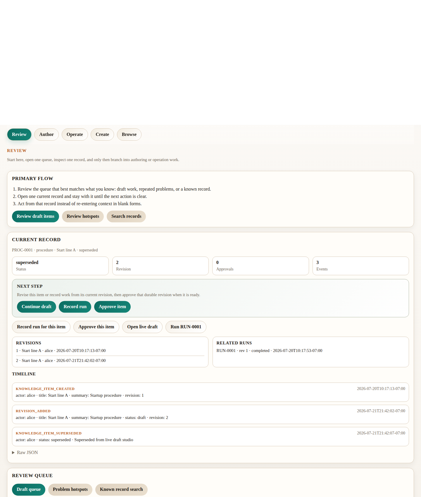
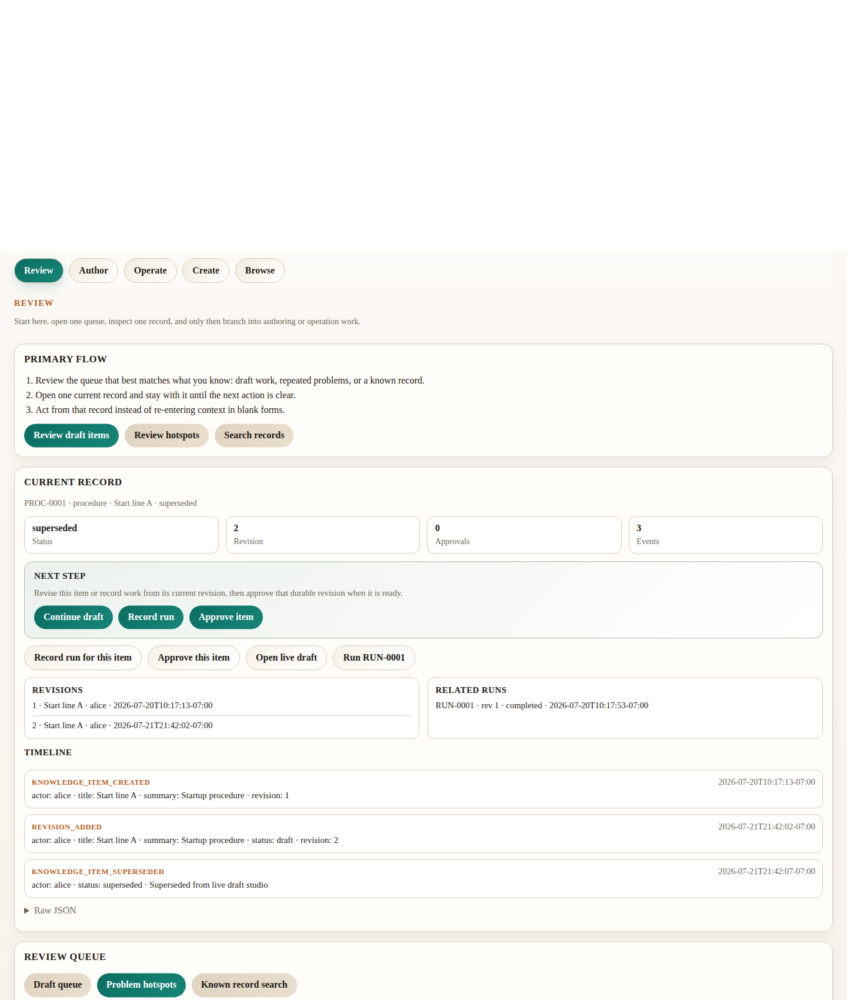
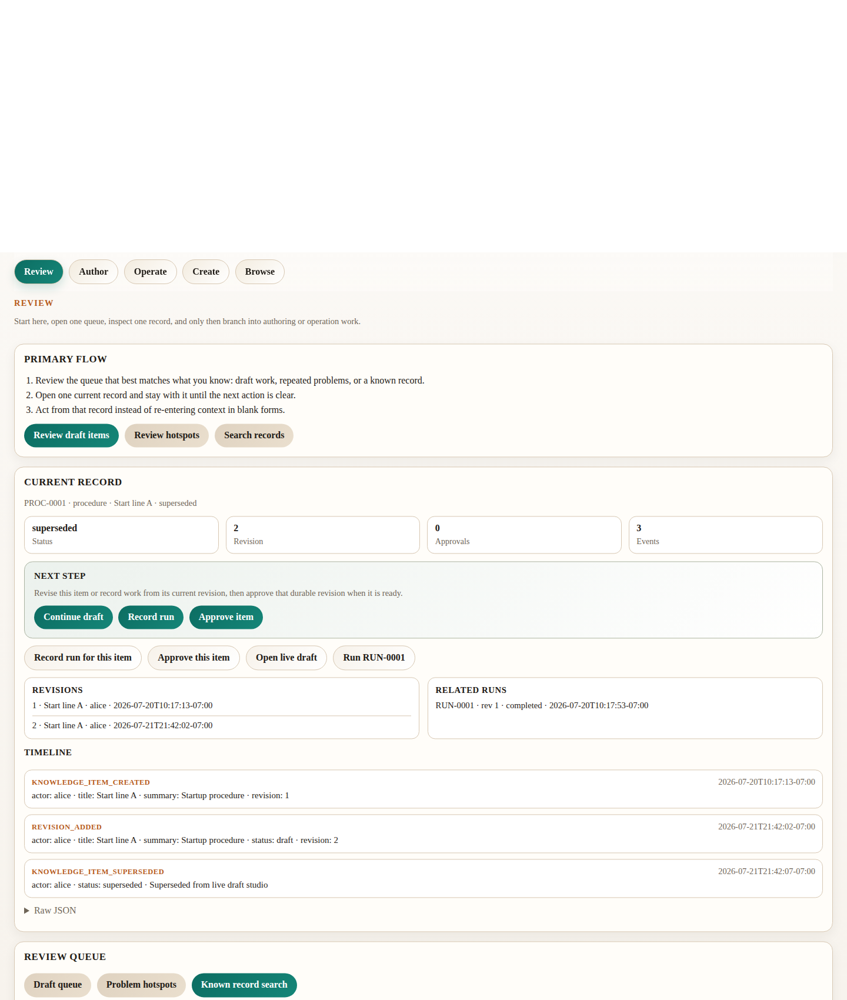
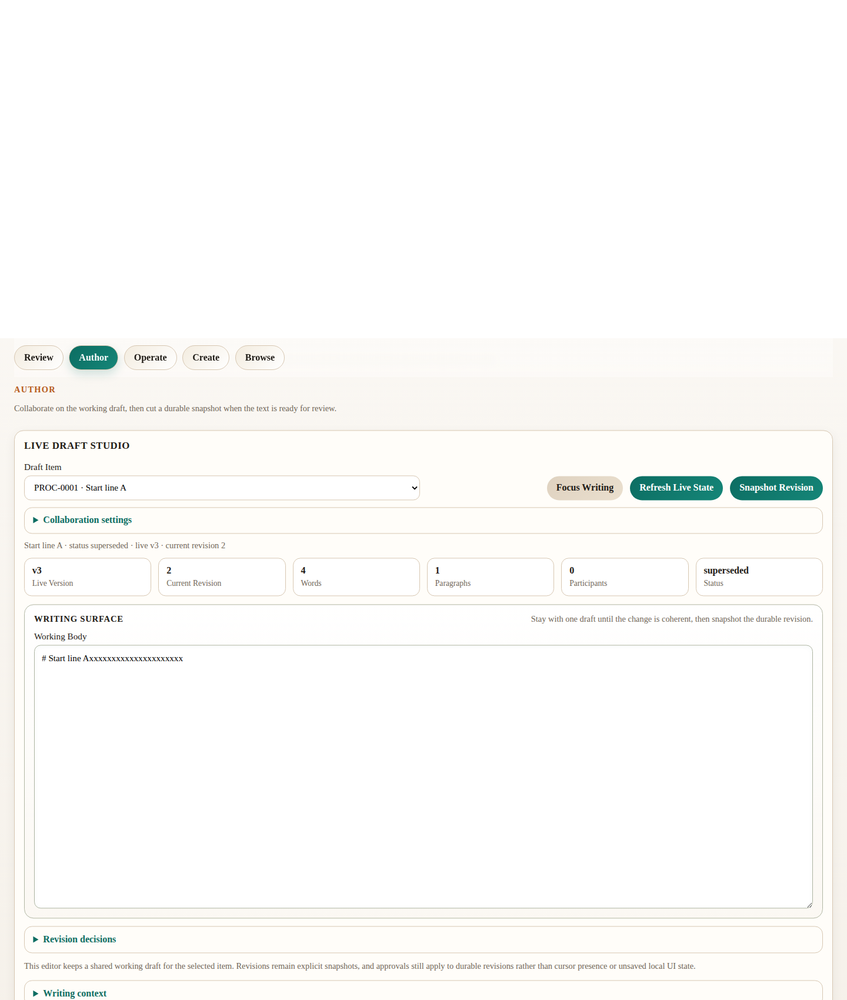
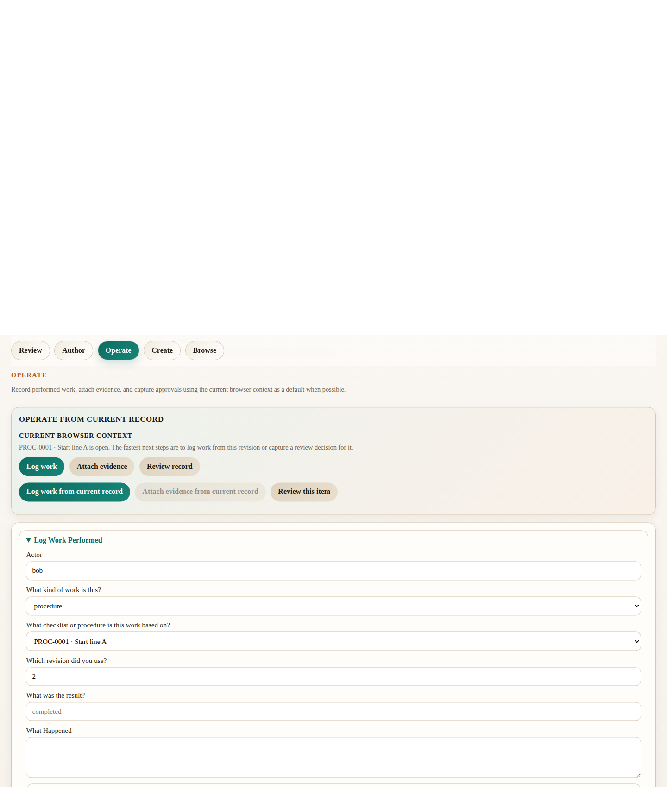
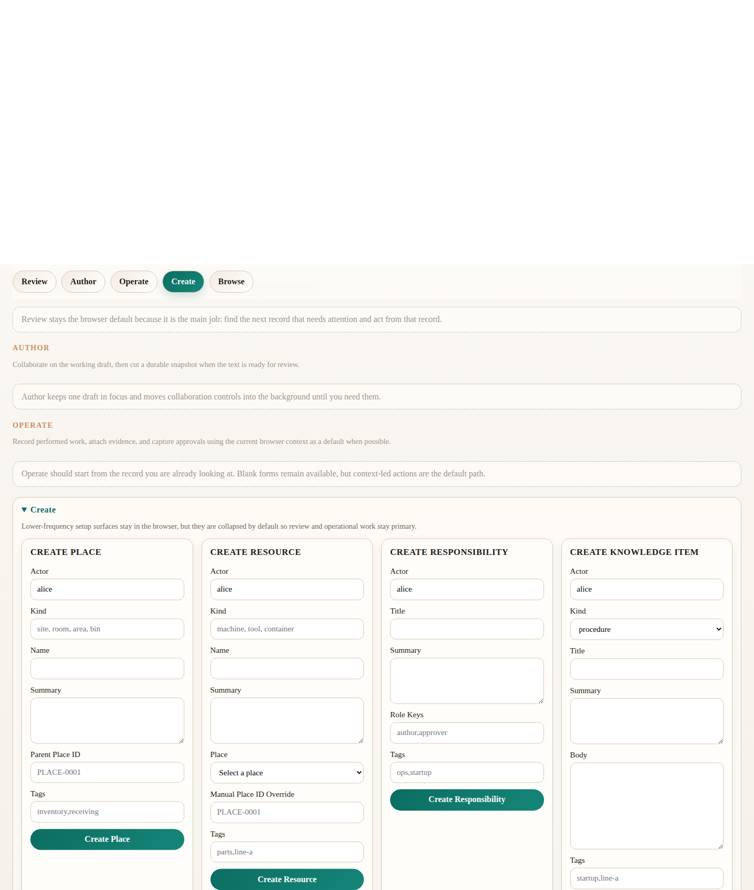
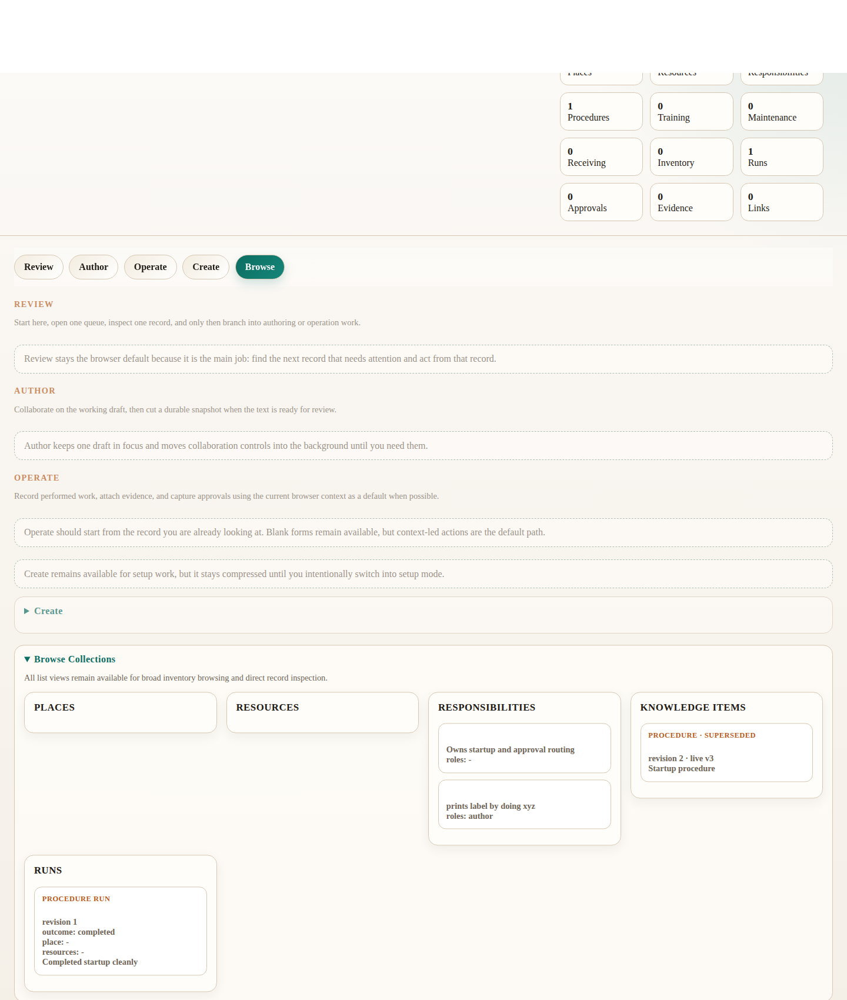

# Ex5 Browser UI Guide

This guide explains the shipped browser surface in
`ex5-operational-knowledge-system`. It is for operators, reviewers, and team
leads who want to use the browser without guessing what each panel, field, or
review area means. It describes the current UI as implemented in
`web/index.html` and `web/app.js`. Source: `DI-nalor`.

The browser now intentionally uses more task-oriented wording in the busiest
forms. Labels like `Procedure / Checklist`, `Review This Record`, and `Owning
Role` appear in the UI even though the underlying APIs and stored records still
use the existing item, run, place, resource, and responsibility model. Source:
`DI-vazut`.

## What The Browser Is For

The browser is the broadest operational surface in `ex5`. It combines:

- creation of context records
- creation of knowledge items
- shared live drafting
- run recording
- evidence attachment
- approvals
- grouped problem review
- structured search
- detailed record inspection

The browser matters because it is the one place where a team can move from
setup, to drafting, to recording work, to reviewing the resulting history
without leaving the same embodiment. Source: `DI-fudok`; `DI-honus`;
`DI-vemur`; `DI-nalor`.

## Screen Structure

From top to bottom, the browser is organized into these areas:

1. Hero and dashboard stats
2. Review workspace
3. Author workspace
4. Operate workspace
5. Create workspace
6. Browse Collections workspace

That order is now intentionally review-first:

1. review and triage what needs attention
2. inspect the current record deeply
3. author or revise knowledge
4. record work, evidence, and approvals
5. create new context records only when needed

The screenshots in this guide were captured from the live local browser surface
using the shipped UI, not mockups. They show the main top-level work areas in
their current form.

## Screenshot Gallery

Review home and draft queue:

Review hotspots:

Review search:

Author workspace:

Operate workspace:

Create workspace:

Browse Collections workspace:

## Hero And Dashboard Stats

### What it does

The top banner introduces the product and shows live dashboard counts. This is
the quickest way to answer simple status questions like:

- how many places exist
- how many resources exist
- how many knowledge items exist
- how many runs have been recorded

### Why it matters

It gives a fast operational snapshot before you drill into the detailed lists
or review panels.

## Review Workspace

### What it does

This is the top operational zone of the browser. It contains:

- the shared browser status/error area
- the `Primary Flow` panel
- the `Current Record` review surface
- the `Review Queue`, which now switches between:
  - draft queue
  - problem hotspots
  - known-record search

### Why it matters

This is now the default landing flow. The browser assumes most operators are
reviewing, triaging, or drilling into existing work more often than they are
creating fresh context records. Source: `DI-lafor`.

The Review workspace is also where context-driven operations now begin. Once
you inspect an item, run, place, resource, or responsibility, the inspector
action bar can launch the matching Operate form with the relevant context
already staged. Source: `DI-mitav`.

The browser now also makes its primary flow explicit here:

1. start in the draft queue when you want the clearest “what needs attention?”
   home path
2. switch to hotspots when you need repeated-problem review
3. switch to search when you already know the record or context slice you need
4. open one record in the inspector
5. take the next step from that inspected record instead of jumping back to a
   generic form

That guidance is surfaced directly in the `Primary Flow` panel and reinforced
again inside the inspector’s `Next Step` area. Source: `DI-sorik`.

The browser now also uses a sticky mode rail so Review, Author, Operate,
Create, and Browse feel like explicit working modes instead of one undifferentiated
long page. It does not hide any capability; it changes emphasis and navigation.
Source: `DI-bavum`.

The browser now also compresses inactive workspaces more aggressively, showing
their summary instead of leaving every major panel expanded at once. That keeps
all capabilities reachable while reducing simultaneous visual load. Source:
`DI-nabek`.

The draft queue is now the clearest default review home. It reduces browser
clutter by showing only the most immediate review items first instead of
putting hotspots, search, and multiple larger panels on equal footing at the
same time. Source: `DI-rabok`; `DI-javik`.

### Review Queue Screens

Draft queue:

Problem hotspots:

Known-record search:

## Create Workspace

The Create workspace is now intentionally lower in the page hierarchy and
secondary to Review, Author, and Operate. It still contains all current setup
forms, but it only expands when you switch into Create mode.

## Create Place

### What it does

Use this form to define where work happens. A place can be a site, room, area,
bin, or any location anchor that later runs and resources should attach to.

### Why it matters

Places make later review possible. Problem review, search filters, run history,
and context drilldowns all become much more useful when runs are tied to real
locations.

### Fields

- `Actor`
  - who is creating the place record
  - important because the event log records who created the context
- `Kind`
  - the type of place, such as `site`, `room`, `area`, or `bin`
  - important because search and grouped review use kind as structure
- `Name`
  - the human-readable place label
  - important because this is what operators recognize in review surfaces
- `Summary`
  - short description of what the place is for
  - important because later reviewers need context, not just an ID
- `Parent Place ID`
  - optional parent place such as a room inside a site or a bin inside an area
  - important because hierarchy supports drilldown and location context
- `Tags`
  - optional comma-separated tags
  - important for lightweight labeling and later search conventions

## Create Resource

### What it does

Use this form to define a machine, tool, container, station, or other physical
resource.

### Why it matters

Resources anchor runs to the actual thing involved. They are especially useful
for receiving checks, maintenance records, and inventory audits.

### Fields

- `Actor`
  - who is creating the resource record
- `Kind`
  - resource type such as `machine`, `tool`, or `container`
  - important because it shapes later search and context review
- `Name`
  - human-readable label for the resource
- `Summary`
  - short explanation of the resource
- `Place` helper select
  - optional picker for an existing place
  - important because it reduces raw ID memorization without removing manual override
- `Place ID`
  - optional location anchor for the resource
  - important because it ties the resource back to the place hierarchy
- `Tags`
  - optional comma-separated tags

## Create Responsibility

### What it does

Use this form to define ownership and review roles such as line lead, receiver,
trainer, or approver.

### Why it matters

Responsibilities let the system answer who owned something, who reviewed it,
and which runs or items should be grouped under the same operational role.

### Fields

- `Actor`
  - who is creating the responsibility record
- `Title`
  - human-readable responsibility name
- `Summary`
  - what the role is responsible for
- `Role Keys`
  - optional comma-separated role words such as `author,reviewer,approver`
  - important because approvals and review meaning often map back to these keys
- `Tags`
  - optional labels for grouping or search conventions

## Create Knowledge Item

### What it does

Use this form to create a new durable knowledge record such as a procedure,
receiving check, training item, maintenance item, or inventory audit.

### Why it matters

Knowledge items are the durable records that runs, approvals, and revision
snapshots attach to later.

### Fields

- `Actor`
  - who is authoring the initial item
- `Kind`
  - one of the shipped knowledge-item categories
  - important because later review panels and grouped search differ by kind
- `Title`
  - the human-readable item name
- `Summary`
  - short explanation of what the item covers
- `Body`
  - the initial durable text body
  - important because this becomes revision content
- `Tags`
  - optional comma-separated labels
- `Primary Responsibility`
  - optional picker for the first linked responsibility
  - important because it makes common ownership setup easier from the browser
- `Additional Responsibility IDs`
  - optional comma-separated responsibility IDs
  - important because it preserves the full manual multi-ID path

## Live Draft Studio

### What it does

This is the browser’s shared working-draft area for a selected knowledge item.
It is not the same thing as a durable revision. It is a collaborative working
surface where operators can edit the current body before explicitly snapshotting
it into a revision.

### Why it matters

This is the main browser authoring surface. It separates:

- temporary collaborative text work
- durable revision creation
- approval of durable revisions

That separation prevents cursor presence or unsaved local edits from being
mistaken for approved history. Source: `DI-zoruk`; `DI-dazim`; `DI-jabup`.

This authoring zone now sits below the main review workspace so drafting stays
easy to reach without displacing problem triage and inspection. Source:
`DI-lafor`.

The authoring surface now keeps live draft metrics inside the main editor
panel, keeps collaboration settings hidden by default, tucks revision decisions
behind disclosure, and offers a separate `Writing context` disclosure instead
of a permanently visible support sidecar. That makes the writing surface more
dominant and quieter without removing any lifecycle controls. Source:
`DI-rofek`; `DI-tavul`; `DI-farok`.

### Fields And Controls

- `Knowledge Item`
  - selects which item’s live draft you are editing
  - important because all live-draft state is per item
- `Collaboration settings`
  - reveals actor, participant name, and color only when you need them
  - important because it keeps metadata available without making it compete
    with the draft itself
- `Actor`
  - the actor used for snapshot, approval, and supersede actions from this panel
- `Participant Name`
  - the display name shown in participant presence
  - important because live drafting is shared and operators need to know who is present
- `Color`
  - the participant color used in presence pills
- `Working Body`
  - the shared draft text body
  - important because this is the collaborative editing surface
- `Focus Writing`
  - scrolls and focuses the draft body while keeping Author mode visually
    active
  - important because it makes sustained drafting feel separate from review and
    operations

### Buttons

- `Refresh Live State`
  - reloads the current shared draft
  - important when another participant has changed the shared body
- `Snapshot Revision`
  - cuts a durable revision from the current live draft body
  - important because approvals should target durable revisions, not transient draft state
- `Approve Current Revision`
  - records approval for the current durable revision
  - important because it keeps review tied to explicit revision numbers
- `Supersede Item`
  - marks the item as superseded
  - important when the procedure or record should no longer be treated as current

### Supporting Areas

- live draft metadata
  - shows title, status, live version, and current durable revision
- participant list
  - shows who is present, their cursor/head, and typing state
- authoring status cards
  - show live version, current revision, word count, paragraph count,
    participant count, and status
  - important because they make the draft feel trackable while you write
- writing surface frame
  - visually prioritizes the draft body over the surrounding controls
  - important because it makes authoring feel like writing work, not just
    configuration
- `Revision decisions`
  - keeps approval and supersede controls available without making them compete
    with the draft body all the time
- `Writing context`
  - keeps the author-flow guidance reachable without leaving another large
    support panel permanently open

## Log Work Performed

### What it does

Use this form when work has actually been performed. A run records what
happened against an exact knowledge-item revision.

### Why it matters

Runs are the operational history. They are how the system answers:

- which revision was used
- what the outcome was
- where it happened
- which resource was involved
- what later evidence or approvals attached to that event

The inspector can now launch this form already primed for the current item,
run, place, resource, or responsibility so the operator starts from context
instead of retyping IDs. Source: `DI-mitav`.

The operate workspace now also includes an `Operate From Current Record` panel
that makes the default run/evidence/review action explicit for the record
already open in Review. Source: `DI-matub`.

The operate workspace now also stages the heavier transaction forms behind
smaller action choices: `Log work`, `Attach evidence`, and `Review record`.
That keeps the main operate surface lighter while preserving the full generic
forms underneath. Source: `DI-zumor`.

### Fields

- `Actor`
  - who performed or recorded the run
- `Work Type`
  - the run category
  - important because it should match the operational shape of the work
- `Procedure / Checklist`
  - helper select for the item used
  - important because it reduces raw ID entry during the common run-recording path
- `Revision Used`
  - the exact revision used
  - critical because revision-specific history is one of the main product goals
- `Outcome`
  - result such as `completed` or `accepted_with_notes`
- `What Happened`
  - human explanation of what happened
- `Advanced context and manual overrides`
  - reveals item, place, resource, role, machine, and location overrides only
    when they are needed
  - important because it keeps the main action path task-driven while
    preserving the original schema-level escape hatches

## Add Evidence

### What it does

Use this form to attach facts and optional immutable files to a recorded run.

### Why it matters

Evidence turns a run into something reviewable later. It is how later operators
see count facts, receiving inspection facts, photos, and other attached proof.

When you inspect a run or use the matching search action, this form can now
open already targeted at that run so evidence capture becomes a follow-on step
from the reviewed run instead of a separate lookup task. Source: `DI-mitav`.

### Fields

- `Actor`
  - who is attaching the evidence
- `Evidence For Run`
  - helper select for the run receiving the evidence
- `Evidence Summary`
  - short label for the evidence entry
- `Structured Facts (JSON)`
  - structured fact object such as `{"result":"ok"}` or discrepancy details
  - important because later review panels and search surfaces use these facts
- `File Attachment`
  - optional file upload
  - important when the evidence includes a photo, log, or other artifact
- `Manual target override`
  - reveals direct run ID entry only when the current context or helper select
    is not enough

## Capture Review Decision

### What it does

Use this form to attach an approval or review decision to a procedure,
checklist, or run.

### Why it matters

Approvals are how the product records explicit review, not just that something
exists. They are central to operational accountability.

The inspector and search actions now let you start approvals directly from the
current item or run context, while the generic approval form and manual
override fields remain available. Source: `DI-mitav`.

### Fields

- `Actor`
  - who is making the review decision
- `What are you reviewing?`
  - whether the approval is for a procedure / checklist or a run
- `Which record is under review?`
  - helper select for the exact item or run being reviewed
- `Revision Being Reviewed`
  - revision number when approving a procedure / checklist
  - important because item approvals must target the durable revision being reviewed
- `Reviewer Role`
  - review role such as `reviewer` or `approver`
- `Review Decision`
  - `approved`, `rejected`, or `noted`
- `Notes`
  - optional explanation for the review outcome
- `Manual target override`
  - reveals direct record ID entry only when the current context or helper
    select is not enough

## Problem Hotspots Lane

### What it does

This review lane groups repeated receiving and inventory problems by place and
resource.

### Why it matters

It is the fastest browser path for answering:

- where repeated receiving problems keep happening
- which resource keeps showing discrepancy or receiving issues

Each card is a hotspot summary rather than a single run. It helps operators
review recurring trouble instead of scanning the full run list.

### What each card shows

- place or resource kind
- grouped ID and name
- total problem count
- receiving problem count
- inventory problem count
- a few short highlights

Each card now also offers direct next-step actions for:

- inspecting the place or resource
- searching problem runs in that hotspot
- searching receiving runs there
- searching inventory runs there

## Known-Record Search Lane

### What it does

This review lane searches places, resources, responsibilities, items, and runs
together.

### Why it matters

Search is the main cross-record review tool. It lets operators move from a word
or filter to the correct record without manually browsing every list.

The search area now starts with task-first presets for draft review, receiving
problems, inventory counts, and broad run discovery. Advanced filters remain
available behind disclosure when you need exact faceting. Source: `DI-rovak`.

### Fields

- main search box
  - free-text query
  - important because it now reaches run evidence facts and approval notes too
- search presets
  - launch the most common review tasks without manually building a filter set
- `Advanced filters`
  - reveal detailed `Work type`, `State`, `Result`, `Where`, `With tool /
    resource`, and `Owned by role` fields
  - important because they preserve the original search power while making the
    default discovery path more humane

### Supporting Areas

- active filters line
  - shows what filter set is currently in effect
- grouped results
  - results are grouped into places, resources, responsibilities, items, and runs
- debug payload disclosure
  - mainly useful for debugging or exact payload inspection
  - important because it keeps the payload available without dominating the normal review path

## Current Record

### What it does

This is the browser’s main detailed review surface. Clicking a list card,
search result, or hotspot card opens the selected record here. The shipped UI
labels this area `Current Record`.

### Why it matters

It turns the browser from a set of forms into a real operational review tool.
This is where the user can inspect:

- summary stats
- direct handoff actions
- approvals
- revisions
- evidence
- related runs
- timeline history
- raw JSON when needed

This inspector is now the visual center of the browser review flow. Search
results, hotspot cards, and list panels all feed into it. Source: `DI-lafor`.

It also now exposes a `Next Step` band ahead of the broader action list so the
browser is more decisive about what the operator should do after opening a
record. Source: `DI-sorik`.

### Main Areas

- metadata line
  - identifies the current record
- summary cards
  - compact counts and core status values
- next step
  - highlights the dominant action for the current record type before the full
    related-action list
- action buttons
  - handoffs into related record views, filtered searches, and context-driven
    operation forms
- review panels
  - revisions, approvals, evidence, receiving review, inventory discrepancy
    history, linked items, or related runs depending on record type
- timeline
  - append-only event history projection
- raw JSON
  - full debug view of the current record payload

## Browse Collections Workspace

The list panels now sit inside a secondary browse workspace instead of taking
top-of-page priority.

## List Panels

At the bottom of the browser are list panels for:

- Places
- Resources
- Responsibilities
- Knowledge Items
- Runs

### What they do

These are the broad inventory views for the current projected state.

### Why they matter

They are the simplest way to:

- browse what exists
- pick a record to inspect
- confirm IDs for later actions

Each card is also a navigation entry into the `Current Record` review surface.

## How The Areas Work Together

The browser is easiest to use when you think of it as one workflow:

1. start in Review with the draft queue home path and the current inspected record
2. switch the `Review Queue` lane only when you need hotspots or known-record
   search instead of the default draft-home path
3. use the mode rail to switch cleanly into Author when you need to revise the current knowledge item
4. use Operate to record runs, evidence, and approvals with the current context prefilled when possible
5. use Create when you need new places, resources, responsibilities, or items
6. use Browse Collections when you want broad inventory browsing instead of targeted review

That is the operational importance of the layout: the upper forms create and
capture work, while the lower review areas let the team find and understand the
resulting history later.

## Where To Read Next

- [User Guide](./user-guide.md)
- [Product Overview](./product-overview.md)
- [Features Guide](./features-guide.md)
- [HTTP API Guide](./http-api-guide.md)
