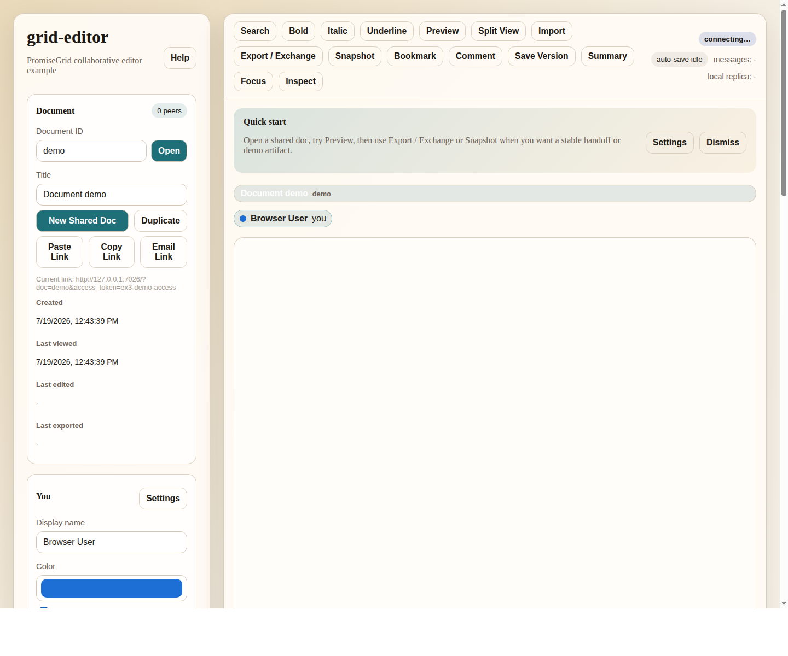

# Updated UI

- Page: `http://127.0.0.1:7026/?doc=demo&access_token=ex3-demo-access`
- Screenshot: `docs/screenshots/ex3-updated-ui.png`
- Captured: `2026-07-19 12:43 America/Los_Angeles`

## Visible State In The Captured Screenshot

The screenshot shows the default `paper` theme with the `demo` document open and the page loaded near the top of the layout.

Visible status in the screenshot:

- Header brand: `grid-editor`
- Subtitle: `PromiseGrid collaborative editor example`
- Current document ID: `demo`
- Current title: `Document demo`
- Peer count pill: `0 peers`
- Share link line: `http://127.0.0.1:7026/?doc=demo&access_token=ex3-demo-access`
- Top-right connection state: `connecting...`
- Auto-save state: `auto-save idle`
- Message counter: `messages: -`
- Replica indicator: `local replica: -`
- Quick start banner is visible
- One visible peer badge row entry: `Browser User  you`
- Main editor pane is visually empty in this screenshot

## Top-Level Layout

The page is split into two main columns:

1. A left sidebar of stacked cards for document controls, identity, workspace, PromiseGrid flow, metadata, relay details, peers, and review/history.
2. A right editor shell containing the toolbar, session status, quick-start banner, document tabs, presence badges, editor pane, preview pane, and modal overlays.

The captured screenshot only shows the upper portion of the sidebar. The lower cards still exist on the page but are below the first viewport cut.

## Sidebar Sections

### 1. Sidebar Header

Purpose:
- brand the demo as `grid-editor`
- identify it as a PromiseGrid collaborative editor example
- expose a `Help` button

Visible in screenshot:
- yes

### 2. Document Card

Purpose:
- choose which shared document is open
- rename the current document
- create or duplicate a shared document
- copy/share/paste the current tokenized link
- show simple document timestamps

Controls:
- `Document ID` text box
- `Open` button
- `Title` text box
- `New Shared Doc`
- `Duplicate`
- `Paste Link`
- `Copy Link`
- `Email Link`

Readouts:
- `Current link`
- `Created`
- `Last viewed`
- `Last edited`
- `Last exported`
- peer count pill in the card header

Visible in screenshot:
- yes

Current screenshot values:
- document id: `demo`
- title: `Document demo`
- peer count: `0 peers`
- last edited: `-`
- last exported: `-`

### 3. You Card

Purpose:
- define the local participant identity that the browser advertises to the relay and other editors

Controls:
- `Display name`
- `Color`
- `Settings` button

Readouts:
- color preview swatch
- color preview name/value
- participant ID

Visible in screenshot:
- partially visible

Current screenshot values:
- display name: `Browser User`
- color picker: blue value corresponding to the current participant color

### 4. Workspace Card

Purpose:
- show open tabs, recent docs, and templates
- provide quick doc/template generation actions

Subsections:
- `Open tabs`
- `Recent docs`
- `Templates`

Buttons:
- `Generate Demo Doc`
- `Sample Doc`

Visible in screenshot:
- no, below the first viewport cut

### 5. PromiseGrid Flow Card

Purpose:
- show the live data-flow story for the current document
- display the transport mode in use
- show relay-observed message traffic for the current document
- let the user click a message for decoded inspection

Elements:
- transport pill
- flow diagram
- trace caption
- `message-trace` list

Flow diagram labels:
- `Browser`
- `signed grid message`
- `Relay`
- `peer feed`
- `Peer relay`
- `websocket fanout`
- `Other editor`

Visible in screenshot:
- no, below the first viewport cut

### 6. Metadata Card

Purpose:
- edit relay-backed descriptive metadata for the document

Fields:
- `Description`
- `Summary`
- `Tags`
- `Collections`
- `Favorite`
- `Archived`
- `Save Metadata`

Visible in screenshot:
- no

### 7. Relay Card

Purpose:
- expose the local relay/author identity and the pCID identifiers used by the demo

Readouts:
- `Author`
- `live-document pCID`
- `live-awareness pCID`
- `document-metadata pCID`
- `publish-document pCID`
- `demo profile` pill

Visible in screenshot:
- no

### 8. Peers Card

Purpose:
- list live participants and their presence state

Readouts:
- live presence legend
- peer list

Visible in screenshot:
- no

### 9. Review Card

Purpose:
- collect non-editor support views for inspection and presentation

Subsections:
- `Outline`
- `Saved versions`
- `Recent participants`
- `Activity`
- `Published exchanges`
- `Catalog search`

Catalog search controls:
- metadata search query
- include archived toggle
- `Search Catalog`
- results list

Visible in screenshot:
- no

## Editor Shell Sections

### 10. Toolbar

Purpose:
- expose the main editing and demo actions

Buttons visible in the screenshot:
- `Search`
- `Bold`
- `Italic`
- `Underline`
- `Preview`
- `Split View`
- `Import`
- `Export / Exchange`
- `Snapshot`
- `Bookmark`
- `Comment`
- `Save Version`
- `Summary`
- `Focus`
- `Inspect`

Visible in screenshot:
- yes

### 11. Toolbar Status Cluster

Purpose:
- expose current connection and local editor state

Readouts:
- `connecting...`
- `auto-save idle`
- `messages: -`
- `local replica: -`

Visible in screenshot:
- yes

### 12. Quick Start Banner

Purpose:
- orient a new user to the expected demo flow

Text:
- `Open a shared doc, try Preview, then use Export / Exchange or Snapshot when you want a stable handoff or demo artifact.`

Buttons:
- `Settings`
- `Dismiss`

Visible in screenshot:
- yes

### 13. Document Tab Bar

Purpose:
- show currently open document tabs

Visible tab in screenshot:
- `Document demo`
- secondary slug text: `demo`

Visible in screenshot:
- yes

### 14. Editor Presence Row

Purpose:
- show local and remote participant badges above the editor

Visible badge in screenshot:
- `Browser User`
- `you`

Visible in screenshot:
- yes

### 15. Editor Pane

Purpose:
- host the live collaborative editor itself

Visible in screenshot:
- yes

Current screenshot state:
- empty white editor region with no visible document text

### 16. Preview Pane

Purpose:
- show rendered preview of the same document

State:
- hidden by default
- shown when `Preview` or `Split View` is used

Visible in screenshot:
- no

## Hidden Overlays And Panels

These are part of the current UI even though they are not visible in the captured screenshot.

### 17. Settings Panel

Contains:
- theme selector
- line numbers toggle
- font size range
- dyslexia-friendly spacing toggle
- presence profile selector
- shortcut bindings

### 18. Help Panel

Contains:
- keyboard shortcut/help grid

### 19. Search Panel

Contains:
- find
- replace
- case sensitive toggle
- regex toggle
- `Find Next`
- `Replace All`
- `Go To Line`

### 20. Export / Exchange Panel

Contains:
- export buttons for Markdown, HTML, Plain Text, and Automerge
- copy buttons
- publish/import exchange buttons
- audit report export

### 21. Comments Panel

Contains:
- selected text
- comment body
- save/resolve actions
- comment list

### 22. Document Summary Panel

Contains:
- generated summary text
- `Read Aloud`
- `Voice Input`

### 23. PromiseGrid Inspector Panel

Purpose:
- show expanded debug/inspection output, including clicked message details

### 24. Hidden File Import Control

Purpose:
- support importing `.md`, `.txt`, `.html`, `.json`, and images

### 25. Toast Stack

Purpose:
- show transient status/error notifications

## Demo-Relevant Reading Of The Current UI

The current page is designed around three parallel stories:

1. **Editing story**
   - toolbar
   - editor pane
   - preview pane
   - comments
   - summary

2. **Collaboration story**
   - document card
   - peers card
   - presence row
   - relay card

3. **Presentation / explanation story**
   - PromiseGrid Flow card
   - PromiseGrid Inspector
   - Review card
   - export/exchange actions

The screenshot captured only the top of that experience, which is why the visible page mostly emphasizes the editor shell and the `Document` / `You` cards rather than the lower PromiseGrid-specific explainer cards.
